# Actividad: Exploración y administración avanzada de Git mediante un script interactivo
#### Índice
- [Preguntas](Preguntas)
- [Ejercicios](Ejercicios)

# Exploración del script interactivo
## 1. Inicio del script
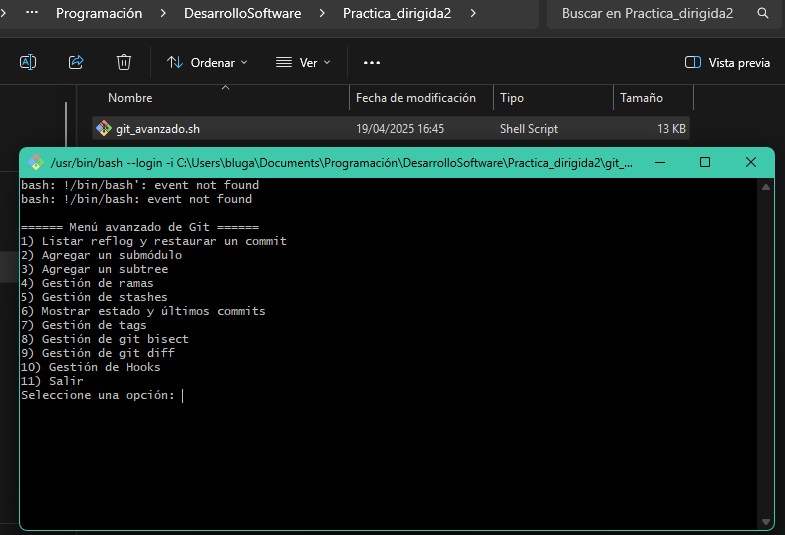
## 2. Agregar un submódulo
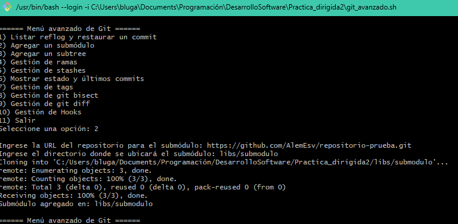
## 3. Gestión de ramas
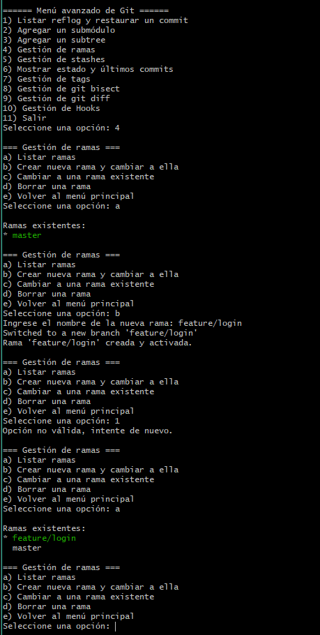
## 4. Gestión de git diff
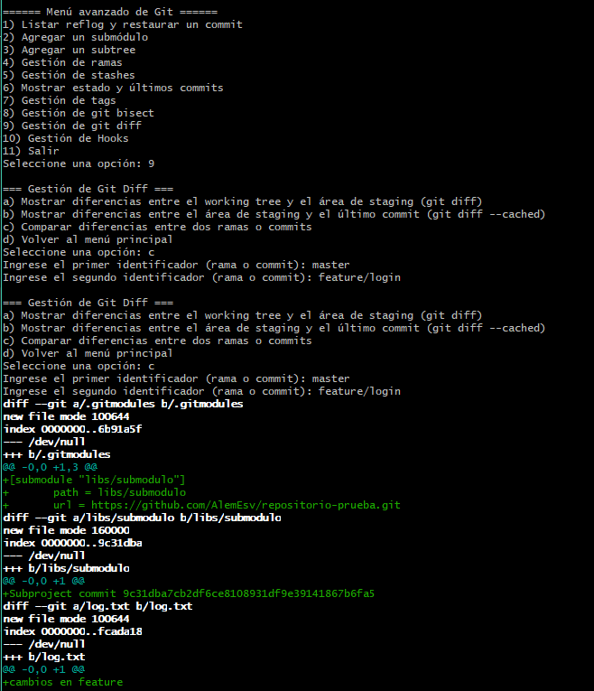
## 5. Gestión de hooks
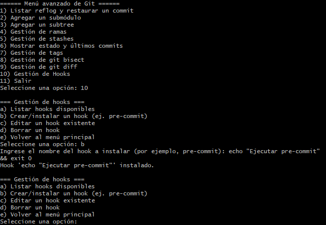

# Preguntas
### 1. ¿Qué diferencias observas en el historial del repositorio después de restaurar un commit mediante reflog?
El comando git reflog permite acceder al historial interno de movimientos de HEAD, incluso aquellos que no están en la línea visible del historial de git log. Cuando restauras un commit desde el reflog, recuperas un estado anterior del repositorio que quizás habías descartado con un reset o rebase. 
Esto no elimina otros commits, pero puede hacer que tu rama apunte a un punto diferente, lo cual puede desalinear la historia visible en git log.
### 2. ¿Cuáles son las ventajas y desventajas de utilizar submódulos en comparación con subtrees?
Los submódulos permiten vincular un repositorio externo como dependencia, manteniéndolo separado del repositorio principal, facilitando mantener actualizaciones independientes. Aunque puede ser complicado de usar porque se requiere de comandos específicos para clonar, actualizar o hacer commits. Los subtrees integran el repositorio externo dentro del historial del proyecto principal, simplificando la gestión para usuarios. Dificultando mantener sincronización con el repositorio original al hacer cambios muy frecuentes.
### 3. ¿Cómo impacta la creación y gestión de hooks en el flujo de trabajo y la calidad del código?
Los hooks permiten ejecutar scripts automáticamente en distintos momentos del ciclo de vida de los commits, como antes de hacer un commit o un push. Mejorando  la calidad del código gracias a las verificaciones automáticas como pruebas unitarias o validación de mensajes de commit. Aunque su mantenimiento puede ser un desafío en equipos grandes si no se gestionan bien, ya que no se versionan por defecto con el repositorio.
### 4. ¿De qué manera el uso de `git bisect` puede acelerar la localización de un error introducido recientemente?
git bisect automatiza la búsqueda binaria en el historial de commits para encontrar el punto exacto donde se introdujo un error. En vez de revisar todos los commits uno a uno, permite dividir el rango de commits en mitades y verificar si el error aún está presente, reduciendo drásticamente el número de pruebas necesarias. 
### 5. ¿Qué desafíos podrías enfrentar al administrar ramas y stashes en un proyecto con múltiples colaboradores?
En un equipo grande, la gestión de ramas puede volverse caótica si no se siguen políticas claras de revisión y fusión. Los stashes pueden introducir conflictos si los desarrolladores los usan para guardar trabajo temporal sin recordar aplicarlos correctamente más adelante, o si intentan compartir código sin integrarlo a una rama. También puede ocurrir que se pierdan cambios si alguien borra o sobrescribe accidentalmente una rama o un stash. Para mitigar estos problemas, es esencial una buena comunicación, reglas de trabajo establecidas y el uso de herramientas de CI/CD que refuercen las prácticas colaborativas.
# Ejercicios

## 1. Funcionalidad para renombrar ramas
### Modificar la función de "Gestión de ramas"
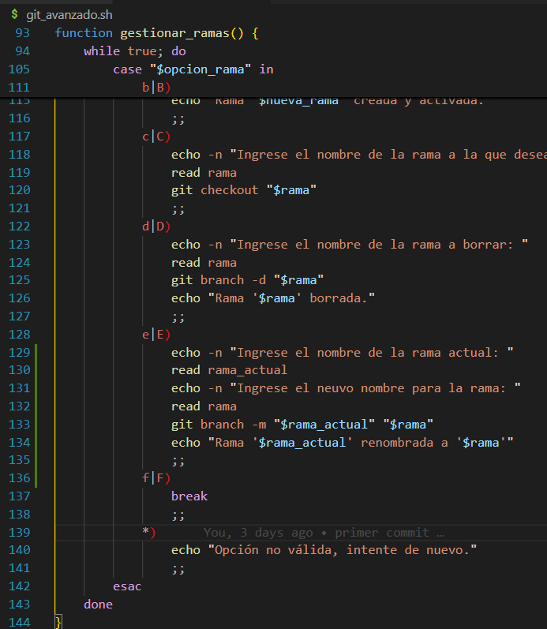
### Implementación:
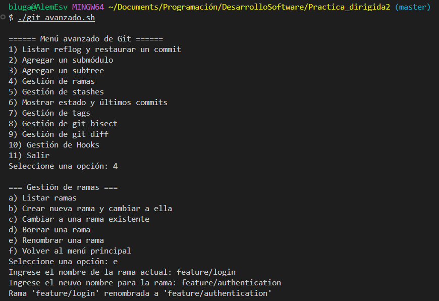
### Verificación:
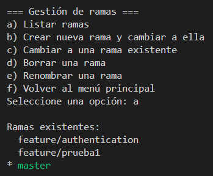
## 2. Diferencias de un archivo entre 2 commits o ramas
### Creación *main.py* con cambios hechos solo en master:
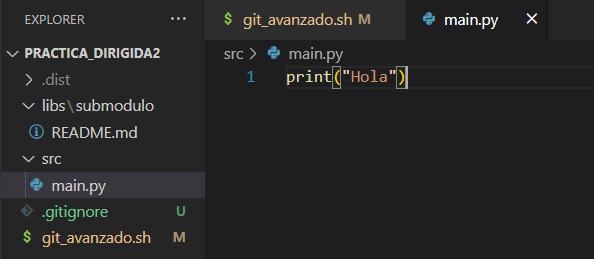
### Creación de la función Comparar diferencias de un archivo específico:
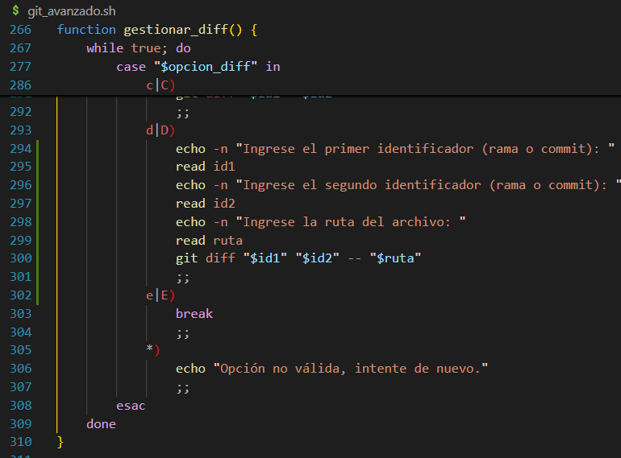
### Validación:
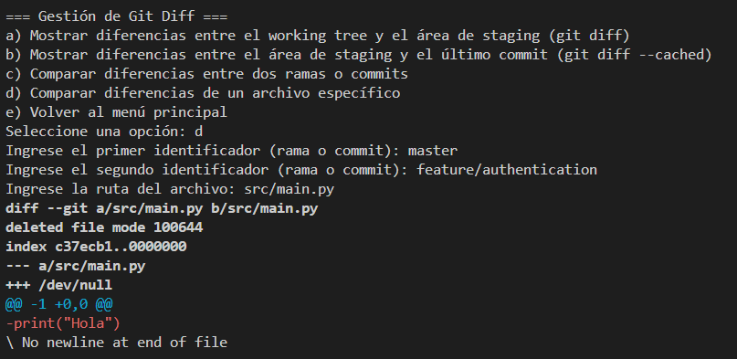
## 3. Funcionalidad para instalar un hook
### Creación del hook *pre-commit*:
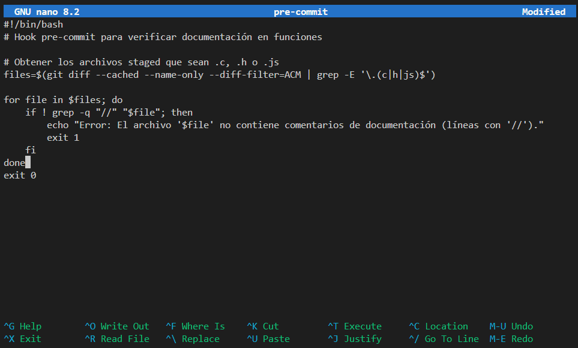
### Integración del hook en *git_avanzado*:
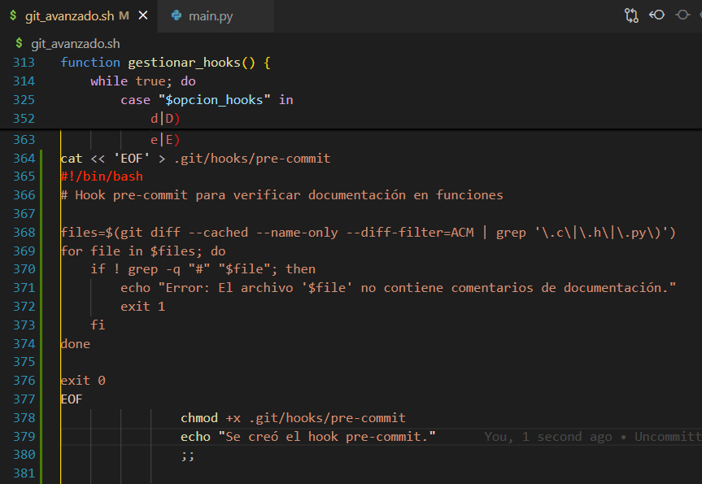
### Validación:
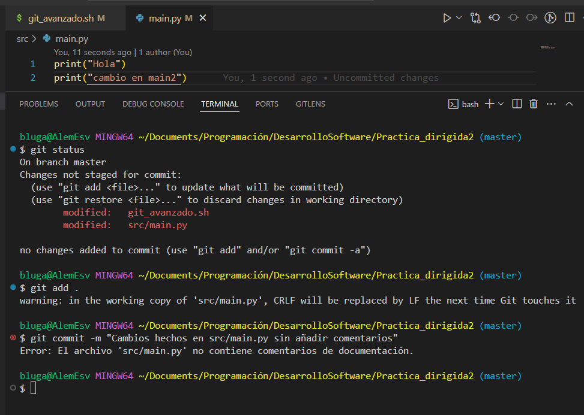
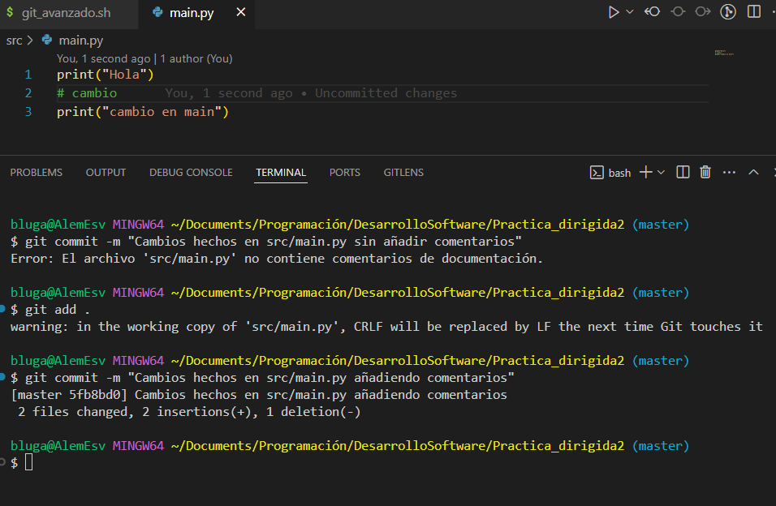
## 4.  Merge automatizado de una rama
### Creación y validación:
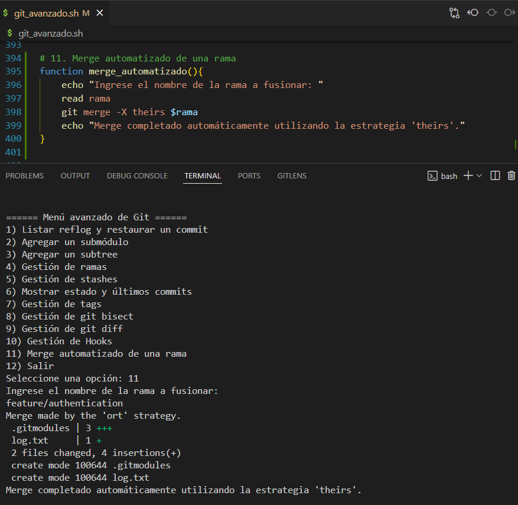
## 5. Reporte con información relevante del repositorio
### Creación de la función *generar_reporte*
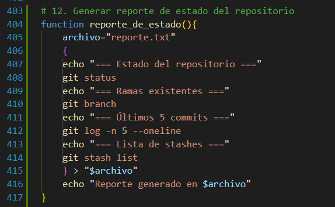
### Validación:
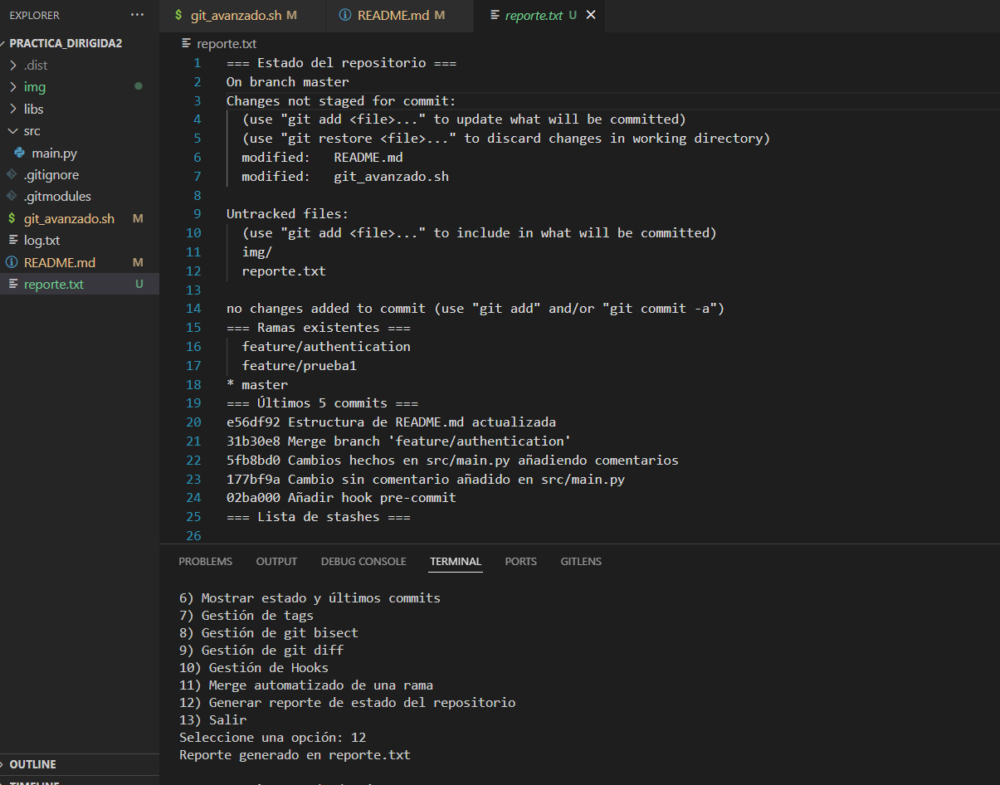
